#programacion #cs #algoritmos #DSA

> **Tabla de contenidos:**

- [Associative array (Maps/Dictionaries)](#associative-array-mapsdictionaries)
- [Linked Lists](#linked-lists)
- [Trees](#trees)
	- [Tipos de Arboles](#tipos-de-arboles)
- [Stacks \& Queues](#stacks--queues)
	- [Stacks (Pila)](#stacks-pila)
	- [Queues (Cola/Fila)](#queues-colafila)
	- [Conceptos Generales sobre Stacks y Queues.](#conceptos-generales-sobre-stacks-y-queues)
- [Heaps](#heaps)
- [Graphs](#graphs)
	- [Tipos de aristas.](#los-aristas-pueden-ser-de-dos-tipos)
	- [Algoritmos para recorrer grafos.](#algoritmos-para-recorrer-grafos)
- [¡Gracias por leer!](#gracias-por-leer)
	- [Lo que ha quedado pendiente (+ RECURSOS)](#lo-que-ha-quedado-pendiente--recursos-)

---

_Cualquier concepto que este erróneo o mal explicado, hágamelo saber con una Issue/Pull Request_

DSA es un acrónimo de **"Data Structures and Algorithms"** (Estructura de datos y algoritmos) e influye un rol importante en la programación debido a que, quieras o no, siempre vas a ser uso de estructuras de datos como **Arrays, Stacks, Queues**, etc. para optimizar la forma en la cual almacenas los datos, y los algoritmos son esenciales para realizar acciones de **búsqueda, agrupación, iterar listas** hasta conceptos mas complejos como buscar el camino mas corto.

**Todos estos conceptos se pueden fortalecer en plataformas como [LeetCode](https://leetcode.com) y las actividades recomendadas estarán en esa plataforma.**

*Empecemos sin dar tanta vueltas.*

## Associative array (Maps/Dictionaries)

El concepto de **Mapa** se utiliza por Java y C++ mientras que **Diccionario** es usado por .Net y Python, así que tratare de englobar esto lo mas que pueda.

Un **Associative Array (Arreglo Asociativo)** almacena los datos en una colección utilizando una _key_ (que será un identificador único al cual, en el código, nos referiremos a ese para obtener el valor almacenado)  y el _value_ el cual será el dato.

Utilizare a JavaScript para realizar este ejemplo.

```js
// Associative arrays in JS are Objects
const myAssociativeArray = { 
	day: 'monday',
	temperature: 23,
	isRaining: true
}

console.log(myAssociativeArray.day) // monday
console.log(myAssociativeArray.isRaining) // true

// Good use for hashTables:
const HTTPHashTable = {
	GET: () => 'SELECT * FROM table;',
	POST: () => "INSERT INTO user(name,age) VALUES('Juan',20);",
	DELETE: () => 'DELETE FROM user WHERE id = 1;'
	//... etc
}
const query = HTTPHashTable['GET']() // returns 'SELECT * FROM table;'
await sql`${query}`
```

*En algunos lenguajes los array asociativos si se pueden iterar, caso contrario que las HashTables*

## Linked Lists

Una **Linked List (Lista Enlazada)** es una _Linear Data Structure (Estructura de datos lineal)_ de nodos, cada uno referenciando al que le sigue. Esto tiene variaciones, pero prefiero ir a la base y no indagar en sus diferentes tipos.

La diferencia que tiene de un _Arreglo_ es que cada nodo almacena la referencia de memoria de sus nodos adyacentes. El primer nodo se llama _head_ y el ultimo nodo se llama _tail_ y suele apuntar a un valor _nulo_ para indicar que no hay mas valores a continuación.
Hay casos donde esto no ocurre debido a que se trata de **Circular Linked List**, y el ultimo nodo vuelve a apuntar al *head* en vez de un valor nulo. Porfavor, mire la siguiente imagen y comparé:

**LinkedList example:**
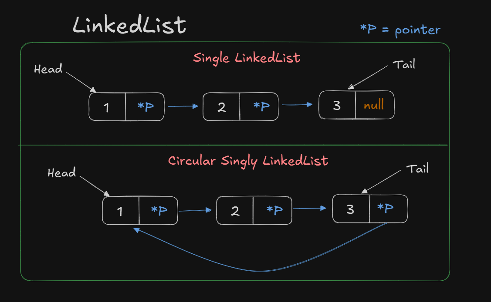*Tambien existen las **Doubly Linked List**, que contienen 3 campos.*
- *__PreviousVal__: Un puntero al nodo anterior.* 
- *__Value__: El valor actual de este nodo.*
- *__NextVal__: Un puntero al siguiente nodo.*

En este ejemplo, supongamos que nuestra LinkedList se llama ```linked```, a la cual solo tiene dos propiedades, (ya que es una *Singly LinkedList*) *NextVal* y *Value* y queremos obtener los valores $1$ , $2$ y $null$ para comprobar que la lista tiene fin. 

Ejemplo en C# de su utilización:

```cs
using System; // this is for the String type & the Console.WriteLine
using System.Collections.Generic; // this is for the LinkedList class

public class Program
{
	public static void Main()
	{
		LinkedList<String> linked = new LinkedList<String>();
		linked.AddLast("1");
		linked.AddLast("2");
		linked.AddLast("3");
		
		Console.WriteLine(linked.First.Value); // 1
		Console.WriteLine(linked.First.Next.Value); // 2
		Console.WriteLine(linked.First.Next.Next.Next.Value); // null
	}
}
```

_Lo ideal seria realizar una función recursiva y detenerse al momento que encuentre un **null**, no conozco demasiado C# para hacer un ejemplo mas pequeño que este pero recomiendo que chequen este [desafío](https://leetcode.com/problems/linked-list-cycle/)._

## Trees

Un **Tree (Árbol)** es una _Non-linear Data Structure (Estructura de datos NO lineal)_, es decir, sus elementos no están alineados secuencialmente por lo tanto no pueden ser todos recorridos en una sola ejecución. Cabe de aclarar que esta estructura siempre suele tener un numero $N$ de nodos y $N-1$ de aristas (debido a que el nodo *Root* no contiene padre).

Esta estructura jerarquiza sus nodos, como si fuese un sistema de carpetas.

```python
Root
├── Home
│	├── MyPC
│	└── User
│
└──	Desktop
	└── Homework
		├── Math
		└── Programming
```

**Binary tree (can have up to two children) example:**


**Un poco de terminología para estar en la misma pagina:**

- El nodo mas alto se llama _Root_ (pintado de rosa).
- Los nodos sin hijos (nodos descendientes) se llaman _Leaf Node_ (pintados de verde).
- Un _Subtree_ (Subárbol) es un conjunto de nodos (junto a sus descendientes) a destacar dentro del mismo árbol principal. Ejemplo: Un subárbol podría ser Home, MyPC y User.

**Un ejemplo de código sencillo en Python (Usando un Subárbol):**
```python
class Tree:
    def __init__(self):
        self.left = None
        self.right = None
        self.name = None

root = Tree()
root.name = "Root"
root.left = Tree()
root.left.name = "Home"
root.right = Tree()
root.right.name = "Desktop"
```

Y así, definiríamos un subárbol de los primeros niveles.

_Al igual que el anterior, esto se podría recorrer con una función recursiva. Recomiendo este [ejercicio sencillo](https://leetcode.com/problems/binary-tree-paths/) para empezar a entender arboles mejor._

#### Tipos de Arboles:

- Un nodo de un _Tree_ puede tener un numero infinito de hijos, mientras que un _Binary Tree (Árbol Binario)_ tiene un máximo de 2 hijos, cuales suelen ser referidos como _Left Node_ y _Right Node_.

- Un _Binary Search Tree (Árbol de búsqueda binaria)_ suele utilizar números como valores, en vez de nombres previamente visto en los ejemplos. Supongamos que el _Root_ empieza con el valor de **10**, el hijo izquierdo de este siempre será menor al nodo padre, es decir, tendrá el valor de **9** o menos mientras que el hijo derecho siempre será mayor al nodo padre, por ejemplo, **11** o mayor. Y así recursivamente con los hijos.

Hay mas tipos de arboles, pero creo que estos tres mencionados dan una base solida para adentrarse a las estructuras de datos. Procura de estudiarlos bien ya que son los mas comunes.


## Stacks & Queues

#### Stacks (Pila)

Una manera sencilla de entender este concepto es imaginarlo como si fuese un _Array/Arreglo_ en el cual al añadir un elemento, este creará un nuevo espacio y se insertara a lo ultimo de este arreglo. Y la forma para remover elementos, es quitando el ultimo elemento. Esto esta basado en el principio **LIFO** (Last In First Out) el cual el primer elemento añadido es procesado a lo **ultimo** y el ultimo elemento es el **primero** a procesar.

**Ejemplo en JS:**
Imagínate que estas lavando los platos y los vas apilando uno arriba del otro, y en el momento que terminas de lavarlos, tienes una pila gigantesca de estos.
Lo mas lógico seria ir quitando desde el mas arriba (El ultimo añadido a la pila) hasta llegar al primer plato que lavaste (El primero añadido a la pila).

```js
const dishStack = [21, 45, 78] //the numbers does not represent anything in particular

// we add more dishes to the stack
dishStack.push(96)
dishStack.push(4)

console.log(dishStack) // [21, 45, 78, 96, 4]

// and then we start to removing the dishes off the stack
dishStack.pop()
console.log(dishStack) // [21, 45, 78, 96]

dishStack.pop()
dishStack.pop()
console.log(dishStack) // [21, 45]
```

#### Queues (Cola/Fila)

No es tan distinto a las Stacks a diferencia de que este caso se aplica el principio **FIFO** (First In First Out) que trata que el primer elemento añadido (o el elemento con mas tiempo en la fila) sea el primero a ser procesado.

**Ejemplo en JS:**
Visualiza que estas en un supermercado bastante conocido ubicado en el centro de la ciudad donde te resides. Agarras un carrito y empiezas a colocar los productos que necesitas y una vez que termines de seleccionar lo necesario te diriges a un cajero del mismo establecimiento.
Pero, desafortunadamente, de tanta gente comprando se hizo una **fila**. El que llego mas pronto al cajero va a ser atendido y si alguien llega después de vos, va a ser atendido luego que tu compra termine.

```js
const peopleQueue = ['Alfred', 'Jane', 'Herbert']

//cashier is taking care of the queue
peopleQueue.shift()
peopleQueue.shift()

console.log(peopleQueue) // ["Herbert"]

//more people are joining the queue
peopleQueue.push('Kasey')
peopleQueue.push('Cydney')

console.log(peopleQueue) // ["Herbert", "Kasey", "Cydney"]
```

#### Conceptos Generales sobre Stacks y Queues.

- Ambos son _Linear Data Structure_ y contienen un tamaño dinámico.
- A diferencia de un Array, estos no pueden insertar datos en posiciones aleatorias.
- Todas sus operaciones son de complejidad O(1) ([Articulo sobre el Big O Notation](https://the-amazing-gentleman-programming-book.vercel.app/en/book/Chapter06_Algorithms#big-o-notation)).


## Heaps

Un **Heap (montón)** es una estructura similar a los arboles binarios previamente vistos con una *Priority Queue (Cola de prioridad)*. Lo que lo hace especial a esta estructura de los _Binary Search Tree (Árbol de búsqueda binaria)_ es su facilidad de ordenar Arrays, permite repeticiones, su forma de organizar la información (ver tipos) y la importancia del orden de los nodos.

*Esta estructura tiene 2 tipos predominantes:* 

- **Max Heap:**
El *Root* debe ser el mayor valor de todos los nodos, luego sus hijos deberán siempre ser **menor** o **igual** al nodo padre.
La forma de representación de este Heap en un array seria de:

```python
[10, 6, 3, 2, 5, 1]
```

- **Min Heap:**
El *Root* debe ser el menor valor de todos los nodos, y sus hijos deberán siempre ser **mayor** o **igual** al nodo padre.
La forma de representación de este Heap en un array seria de:
```python
[2, 4, 5, 12, 6, 9, 7]
```
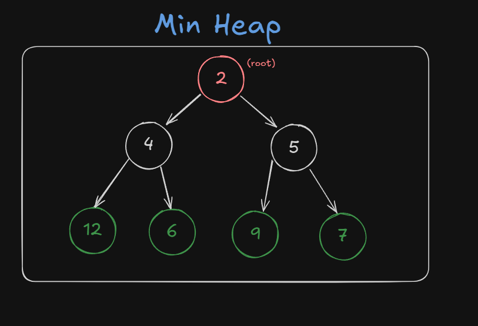

*Para acceder al elemento deseado del Heap, es recomendado utilizar las siguientes operaciones 
( "i" es el índice del elemento del array que se desea saber los siguientes datos):*

-  **Obtener el padre del nodo:**
	- $Array[(i-1)/2]$

- **Obtener el hijo izquierdo del nodo:**
	- $Array[(2*i)+1]$

- **Obtener el hijo derecho del nodo:
	- $Array[(2*i)+2]$

_No voy a brindar un ejemplo de código ya que es demasiado extenso, pero si te voy a dejar una [actividad a resolver](https://leetcode.com/problems/take-gifts-from-the-richest-pile/description/). Aunque la actividad este ligada mas a las priority queues y a la matemática, creo que sigue siendo ideal para resolver._ 


## Graphs

Los **Graphs (Grafos)** son parte de la misma estructura de datos que los *Trees (Arboles)*, una *estructura de datos no lineal*.
La diferencia principal a la de un *Árbol*, es que este **no tiene reglas de como los aristas se deben conectar a los nodos** y su denotación consiste de $G = (V, E)$, siendo *V = vertices* (o como yo los llamo, "Nodos" pero su nomenclatura matemática es de "Vértices") y *E = egdes* (Aristas).

#### Los Aristas pueden ser de dos tipos:

- **Directed (dirigido):** Son aquellos que conectan dos nodos uni-direccionalmente. Es decir, solo van de punto $A → B$ y no viceversa. **Su denotación matemática** es $(A, B)$ siendo $A$ el origen y $B$ el destino.

- **Undirected (no dirigido):** Los no dirigidos, en cambio, conectan dos nodos bi-direccionalmente. Pueden ir de punto $A → B$ y $B → A$. **Su denotación matemática** es { $A,B$ }, sin importar el orden, ya que, no es dirigido.

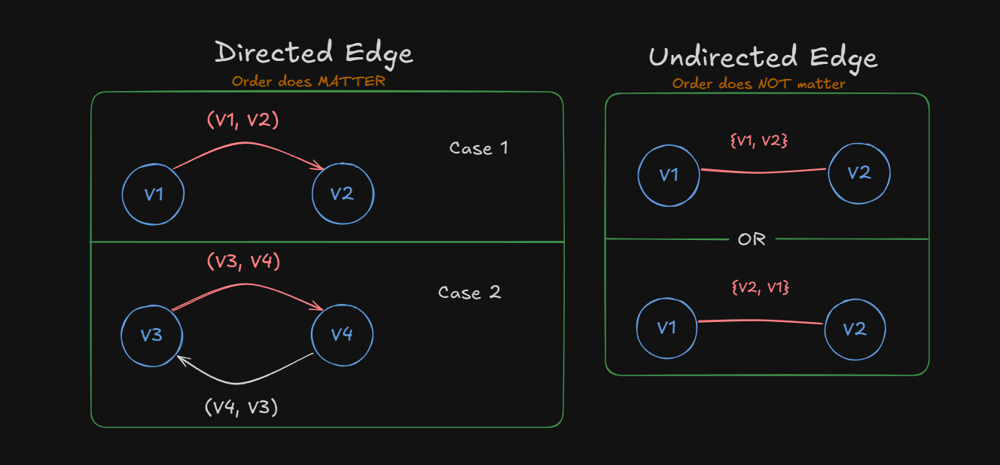

#### Algoritmos para recorrer grafos.

*Los algoritmos que voy a explicar son utilizados para estructuras de datos con forma de arboles, como los Heaps y Graphs.*

- **Depth First Search (DFS):**
En *Depth First Search (Búsqueda en Profundidad)* trata de recorrer el grafo lo mas profundo **posible** sin retroceder utilizando nodos adyacentes. Una vez que no haya mas nodos adyacentes para visitar, empieza a retroceder hasta que encuentre mas nodos sin visitar. 

**Extras:**
- Como un árbol, se suele empezar por el subárbol izquierdo, y una vez que lo recorre, va por el derecho.
- Se crea un arreglo donde se almacena (usualmente de manera booleana) si el nodo fue recorrido. 

**Ejemplo (Usa la imagen de abajo como referencia):**

``` python
- Empieza en 0, Marca como visitado. Output 0
- Recorre 3, Marca como visitado. Output 3
- Recorre 6, Marca como visitado. Output 6
No hay mas nodos adyacentes, se regresa hasta 0.
- Recorre 2, Marca como visitado. Output 2
- Recorre 4, Marca como visitado. Output 4
- Recorre 1, Marca como visitado. Output 1
No hay mas nodos adyacentes, se regresa hasta 4.
- Recorre 5, Marca como visitado. Output 5
Fin.
```

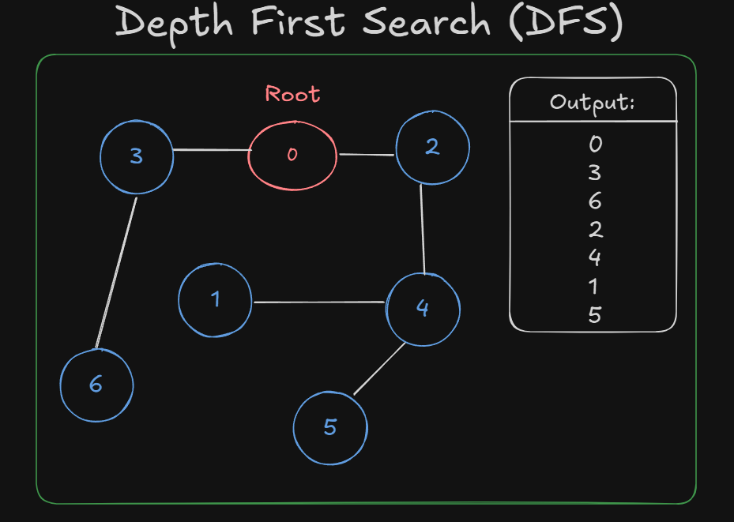
*Usualmente utilizado para PathFinding, resolver laberintos o detección de ciclos en el grafo.*

- **Breadth-First Search (BFS):**
 Dado un Grafo no dirigido, *Breadth-First Search (Búsqueda en amplitud)* trata de navegar por los nodos adyacentes, de izquierda a derecha, hasta llegar a lo mas profundo (no encontrar mas nodos adyacentes) o llegar a un nodo previamente recorrido.
 
 **Extras:**
 - Usualmente se utiliza una *queue* para mantener en memoria los nodos adyacentes pero no visitados aun.
 - Se añade un elemento a la Queue cuando un nodo es recorrido y contiene adyacentes no repetidos en la lista.

**Ejemplo (Usa la imagen de abajo como referencia):**
``` python
- Empieza en 0, Queue: [5, 4, 6]. Output 0
- Recorre 5, Queue: [4, 6, 1]. Output 5
- Recorre 4, Queue: [6, 1]. Output 4
- Recorre 6, Queue: [1, 3]. Output 6
- Recorre 1, Queue: [3, 2]. Output 1
- Recorre 3, Queue: [2]. Output 3
- Recorre 2, Queue: []. Output 2
Fin.
```

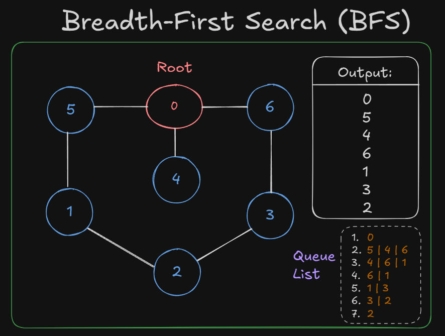
*Utilizado para resolver puzzles, encontrar el camino mas corto de unweighted graphs (grafos no ponderados) o transmisiones en redes.*

- **Dijkstra’s Algorithm**:
El *Dijkstra’s Algorithm (Algoritmo de Dijkstra)* es un tipo de **weighted graph (grafo ponderado)**, (es decir, los *Edges (Aristas)* tienen un peso/numeración que representan un costo, distancia o similar) y sirve para encontrar el camino mas corto usando la menor cantidad de recursos posibles del punto $A → B$ o inclusive, mas de uno $A →$ {$B, C, D$} .

**Extras:**
- Su complejidad algorítmica (Big O Notation) es de  $O((V + E) log V)$ siendo $V$ el numero de nodos/vertices y la $E$ el numero de Aristas.
- El Algoritmo de Dijkstra puede ser utilizado tanto en grafos dirigidos como los no dirigidos mientras que no tenga un coste negativo en uno de los Aristas.
- Se suele emplear junto con una *Priority Queue (Cola de prioridad)* y un *Heap (Montículo)* para optimizar su rendimiento.

**Ejemplo (Usa la imagen de abajo como referencia):**
Antes de empezar la ejecución del algoritmo, se toma la distancia de cada uno de los nodos como infinita ($∞$) y crea un set/array de los nodos NO visitados. La ejecución terminara cuando cada nodo tenga su distancia determinada. Nos quedaría lo siguiente:

- **Valores de los Nodos:** $A = 0, B = ∞, C = ∞, D = ∞, E = ∞, F = ∞, G = ∞$
- **Nodos no visitados:** {$A, B, C, D, E, F, G$}

Se empieza por el nodo 0 (en nuestro caso, el "A"), y buscaremos por nodos adyacentes.
Primero definiremos nuestras relaciones adyacentes en una Matriz (aclaro que esto es una forma para resolverlo):
```js
const graph = [
	//node A neighbours ⬇
	[{nodo: "B", peso: 50 }, {nodo: "C", peso: 100}, {nodo: "D", peso: 25}], 
	[{nodo: "F", peso: 100 } ], // node B neighbours
	[{nodo: "E", peso: 75 }], // node C neighbours
	[{nodo: "E", peso: 200 }], // node D neighbours
	[{nodo: "G", peso: 150 }], // node E neighbours
	[{nodo: "G", peso: 25 }], // node F neighbours
]


// each position represents a node, for example, node[0] == "node A" && node[1] == "node B"...
const distance = [0, infinity, infinity, infinity, infinity, infinity, infinity]
const nonVisited = [false, false, false, false, false, false, false]
```

Una vez definida esta matriz, la idea principal para lograr llegar al objetivo podría ser acceder al elemento $graph[i]$ (empezamos primero por nodo "A"), iteramos el arreglo del nodo $i$, conseguimos los valores del diccionario/objeto, cambiamos el arreglo $distance$ y $nonVisited$ (en nuestro caso, pasarían a ser:

```js 
const distance = [0, 50, 100, 25, infinity, infinity, infinity]
const nonVisited = [true, false, false, false, false, false, false]
```

Luego procedemos al siguiente elemento del arreglo ($graph[1] = nodo B$), y le sumamos al nodo F la cantidad de peso ($distance[1]$) del nodo B. Y luego lo marcamos al nodo B como visitado, y asi sucesivamente hasta que el arreglo de $nonVisited$ sea completamente $true$.

*Es tedioso realizar el codigo ya que he utilizado nodos con letras y no numeros, por lo tanto tendria que realizar una funcion/hashmap/enumeration que indique la posición del nodo al que se quiere trabajar según su nombre.*

He aquí los resultados de lo que nos debería dar:
``` python
- Empieza en "A". costeAcumulado: 0
- Recorre "B". costeAcumulado: 50
- Recorre "F". costeAcumulado: 150
- Recorre "G". costeAcumulado: 175
Fin. Total = 175
```
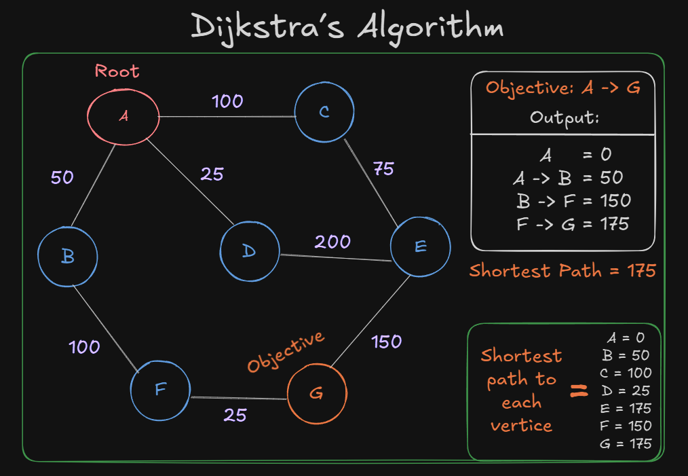
*Su uso suele encontrarse en sistemas de navegación (como GPS), asignación de recursos y análisis de redes sociales.*

*Un buen ejercicio seria [este](https://leetcode.com/problems/path-with-minimum-effort/description/?envType=problem-list-v2&envId=53js48ke), pero ten en cuenta que es dificultad mediana, si te resulta complejo te recomiendo buscar mas recursos sobre este algoritmo, ya que, solo te he demostrado las bases.*

- **A* Search Algorithm**:
El _A* Search Algorithm (El algoritmo de busqueda A*)_ recorre un **weighted graph (grafo ponderado)** para encontrar el camino mas corto/barato. Comparte demasiadas similitudes con *Dijkstra’s Algorithm*, ya que este algoritmo esta basado en él, pero lo que lo diferencia es que emplea **Heuristics (Heurísticos)** para lograr mejor rendimiento, sin tener que recorrer caminos ya descubiertos. 
Su complejidad algorítmica seria de $O(E)$, siendo $E$ los Edges (Aristas).

**Heuristics (Heurísticos):**
En *Ciencias de la Computación*, los heurísticos consisten de métodos o técnicas para resolver problemas de un **Search Space (Espacio de búsqueda)** atreves de intuición y exploración de este mismo, siendo mas rápidos que la manera tradicional de realizarlo, con la desventaja de reducir su precisión al elegir la mejor solución.

*Unos ejemplos de Heuristicos en general pueden ser:*
- **Rule of thumb (regla del pulgar)**.
- **Estereotipos**.
- **Sentido común**.

*(En resumen, simplemente utilizan recursos disponibles para tomar atajos en vez de plantearse la mejor solución de principio a fin.)*
Un caso en un mundo real podría ser una apertura en el Ajedrez. Nunca te vas a plantear las millones de opciones que vas a tener luego de jugar un peón o un caballo para obtener la mejor jugada posible, sino que optaras por la cual te sienta mas confiado.

**Breve explicación de su funcionamiento:**
Para este ejemplo lo representaremos como un *Tree* aunque también, comúnmente en videojuegos, se suelen representan como **Undirected Weighted Adjacency Matrix (Matriz de adyacencia ponderada no dirigida)**, es decir, como una grilla (grid).

*Aquí seria el grafo (luego lo representaremos como un árbol) con cual vamos a trabajar.*


*Primero me gustaría introducir los recursos sobre los que este algoritmo utiliza, y se basa en dos tipos de listas:*

- **Open List (Lista Abierta):** Es una Priority Queue (nodo con valor menor será priorizado) que contiene los nodos próximos a visitar. Cuando esta lista es inicializada, solo almacenará el nodo donde se comienza (en nuestro caso es una $S$ con el valor de 0).

- **Closed List (Lista Cerrada):** Se almacenan los nodos previamente recorridos. Esta misma lista se utiliza también para reconstruir el camino decisivo.

A su vez, también se denomina una **función evaluadora** que nos ayudara a guiarnos en el teorema:
	$f(x) = g(x) + h(x)$ 

Siendo: 
- $g(x)$: El costo del recorrido del estado inicial al nodo $x$.
-  $h(x)$: El costo heurístico estimado del recorrido desde el nodo $x$ al objetivo.

>**1era iteración:**

1) 
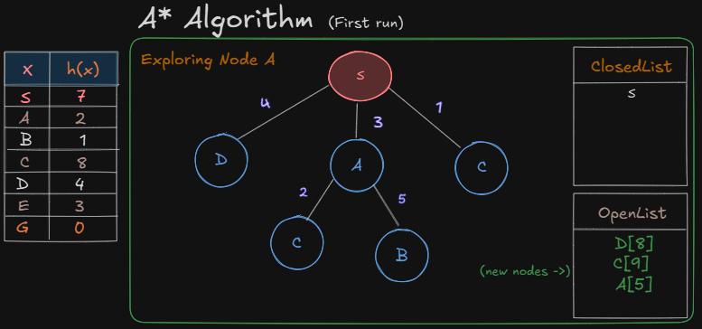
En el primer recorrido, agregamos los nodos adyacentes a la Lista Abierta con su costo utilizando la función $f(x) = g(x) + h(x)$, siendo en este caso: 

- $f(A) = g(3) + h(2)$ En el caso del nodo A ->$A[5]$ 
- $f(C) = g(1) + h(8)$ En el caso del nodo C -> $C[9]$
- $f(D) = g(4) + h(4)$ En el caso del nodo D -> $D[8]$

Por ahora, decidiremos elegir el nodo con el menor costo ( En caso de empate, se puede el elegir el que tiene menos coste heurístico *h(x)* o nodos con mayor *g(x)* ), el nodo A. Y no nos olvidemos de añadir el nodo S a la Lista Cerrada, marcándolo como nodo ya recorrido. 

2) 
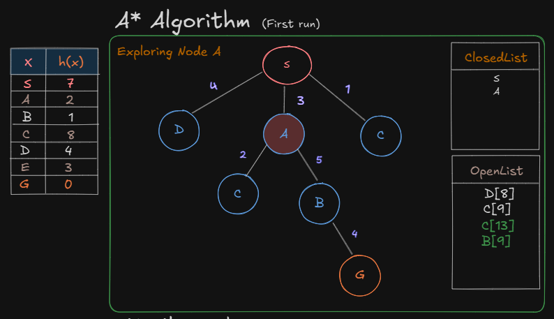
Repetimos lo anterior pero con los nodos C y B, utilizando la misma formula y añadimos el nodo A a la Lista Cerrada.

- $f(C) = g(2+3) + h(8)$ En el caso del nodo C -> $C[13]$
- $f(B) = g(5+3) + h(1)$ En el caso del nodo B -> $B[9]$

*__g(x)__ siempre sumará el costo del recorrido del nodo a ir (en este caso, 2 si hablamos del nodo C) mas los anteriores ya recorridos (solo el nodo A por ahora) = 2 + 3*

3) 
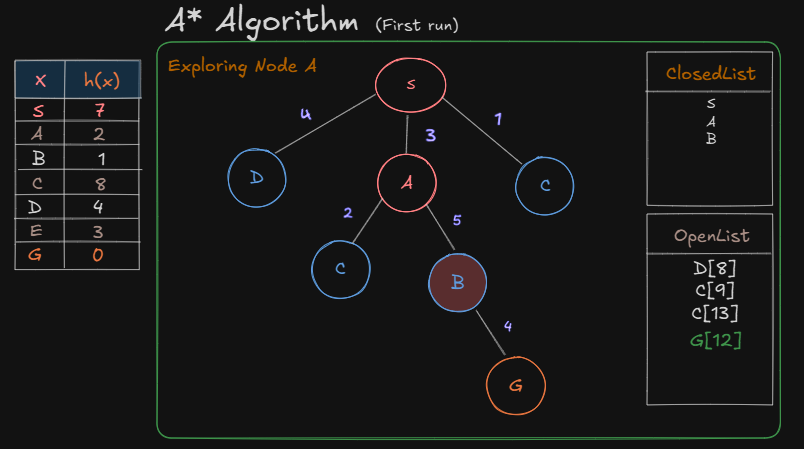
Ahora, realizamos el coste del nodo G PERO aun sin recorrerlo, simplemente calculamos su costo y luego realizamos el segundo recorrido. Añadimos el nodo B a la Lista Cerrada.

- $f(G) = g(4+5+3) + h(0)$ En el caso del nodo G -> $G[12]$

>**2da iteración:**

4) 
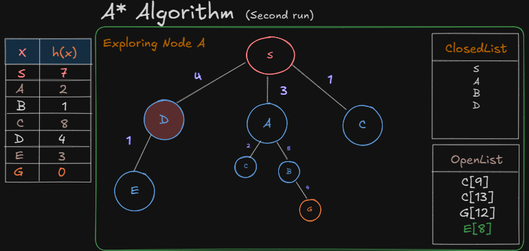
Elegimos ahora en nodo D, ya que, su costo de $D[8]$ es menor a $C[9]$. Y realizamos de nuevo la función evaluadora de nuevo. Añadimos al nodo D a la lista cerrada.

- $f(E) = g(1+4) + h(3)$ En el caso del nodo E -> $E[8]$

5) 
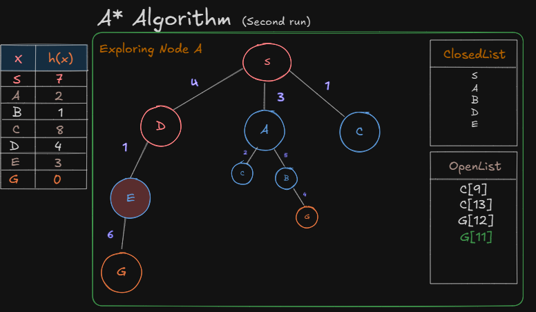
Añadimos el nodo G a la lista cerrada. No lo recorremos y volvemos a realizar la ultima y tercera iteración.

- $f(G) = g(6+1+4) + h(0)$ En el caso del nodo G -> $G[11]$
	
>**3era iteración:**
6) 
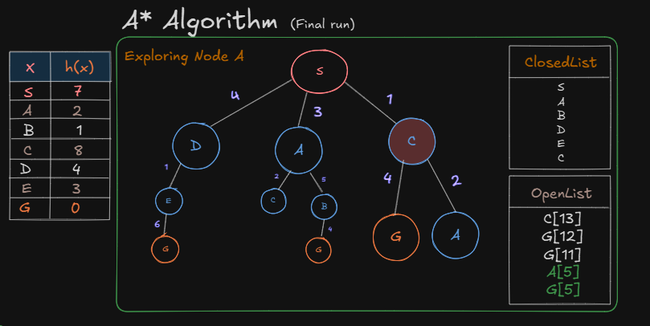
Nos queda solo el nodo G por recorrer, ya que, el nodo A ya se encuentra en la Lista Cerrada y no es necesario recorrerlo. Por lo tanto:

- $f(G) = g(4+1) + h(0)$ En el caso del nodo G -> $G[5]$

7) Entonces, una vez extraídos todos los nodos que llegan al objetivo, comparamos entre las posibles soluciones cual es la que tiene menor coste, y reconstruimos el camino. En nuestro caso, $G[5]$.

**Técnicas para resolver el algoritmo en código**:

Para eso, definiremos tanto como las relaciones de los nodos como sus costos de recorrido y luego, definiremos un Diccionario/Array Asociativo donde estará sus valores heurísticos. 

```js
const nodes = {
"S" : [{node: "D", cost: 4}, {node: "A", cost: 3}, {node:"C", cost:1}],
"A" : [{node: "C", cost: 2}, {node: "B", cost: 5}],
"B" : [{node: "G", cost: 4}],
"C" : {} //etc...
}

const heuristicValues = {
"S": 7,
"A": 2,
"B": 1,
"C": 8,
"D": 4,
"E": 3,
"G": 0
}
```

Supongo que ya tienes una idea de como se podría resolver esto. Voy a darte unas ideas para que :

- Indicas el nodo *root* y el nodo al que buscas llegar.
- Inicializa tanto la *OpenList* como la *ClosedList*.
- **Mientras OpenList NO este vacía:**
	- Selecciona el nodo con menor valor y que no haya sido explorado.
	- Lo mueves a la *ClosedList*.
	- Si encontraste el nodo actual es el *objetivo*, reconstruye el camino y retórnalo.
	- Examinas nodos vecinos/adyacentes.
		- Si el nodo vecino ya esta en la *ClosedList*, lo saltea.
		- **Si el nodo vecino NO esta en la *openList*:** 
			- Calculas sus costos $f(x) = g(x) + h(x)$ 
			- Los añades a la *OpenList*. 
		- **Si el nodo vecino esta ya en la *openList*:**
			- Si su valor $g(x)$ es menor que el nodo actual, actualiza sus valores $g(x)$ y $f(x)$ *(el heurístico sigue siendo el mismo)* y actualiza que su nodo padre al actual ya que, sino, al reconstruir el camino tomará otro inesperado.
		-
- **Mientras OpenList este vacía:**
	- No se ha podido encontrar el nodo *objetivo*. **No existe un camino hacia el objetivo.**

*Una vez se alcance el objetivo, reconstruye el camino al revés utilizando los **nodos padres** hasta llegar a uno que no tenga. Con eso llegarías al nodo **root**. *

Es normal que no lo hayas entendido por completo. Solo busco darte una idea general, y creo que he entrado en demasiado detalle para dejarlo así, por eso, te dejo algunos recursos para que puedas entenderlo mejor:

- [WEB - Visualiza como recorre el algoritmo.](https://pages.trinhminhtriet.com/a-star-search/)
- [WEB - Articulo donde he tomado mas referencias](https://www.codecademy.com/resources/docs/ai/search-algorithms/a-star-search)
- [YT - Explicación general de como funciona en un plano 2d](https://www.youtube.com/watch?v=uJdGyXYk1v0)

*También hay mas algoritmos para recorrer arboles como...*
- **Min-Cost Flow Algorithm.**
- **Prim’s Algorithm & Kruskal’s Algorithm.**
- **Bellman-Ford Algorithm.**

*Si realmente te interesó el tema, te recomiendo chequearlos.*

---
## ¡Gracias por leer!

*¡Eso es todo por este articulo! Ahora es tu turno de practicar.*

Obviamente hay mas estructuras de datos y algoritmos los cuales enseñar, pero este articulo ya se volvió demasiado extenso para ser un repaso de estos.

**En el futuro es posible que haga una parte 2 sobre esto,** pero mientras, me mantendré al tanto de las correcciones y escribiré mas artículos.

#### Lo que ha quedado pendiente (+ RECURSOS) :

- [Algoritmos](https://www3.cs.stonybrook.edu/~skiena/373/videos/):
	- DEPTH-FIRST SEARCH
	- BREADTH-FIRST SEARCH 
	- MERGESORT / QUICKSORT
	- + Greedy Algorithms *(como __Dijkstra's algorithm__ o __Huffman coding__)*
	
- Runtime Analysis: 
	- [BIG O NOTATION (mismo link)](https://the-amazing-gentleman-programming-book.vercel.app/en/book/Chapter06_Algorithms#big-o-notation)
	- Asymptotic Notations.
	
- Estructuras de datos:
	- Trie (Arból Digital)
	
- Extras:
	- Recursion
	- Dynamic Programming

***Y probablemente muchos mas temas.***
*Aquí te dejo un [Roadmap](https://roadmap.sh/datastructures-and-algorithms) relacionado a lo visto por si te encuentras aun confuso o no sabes que es lo siguiente a aprender.*