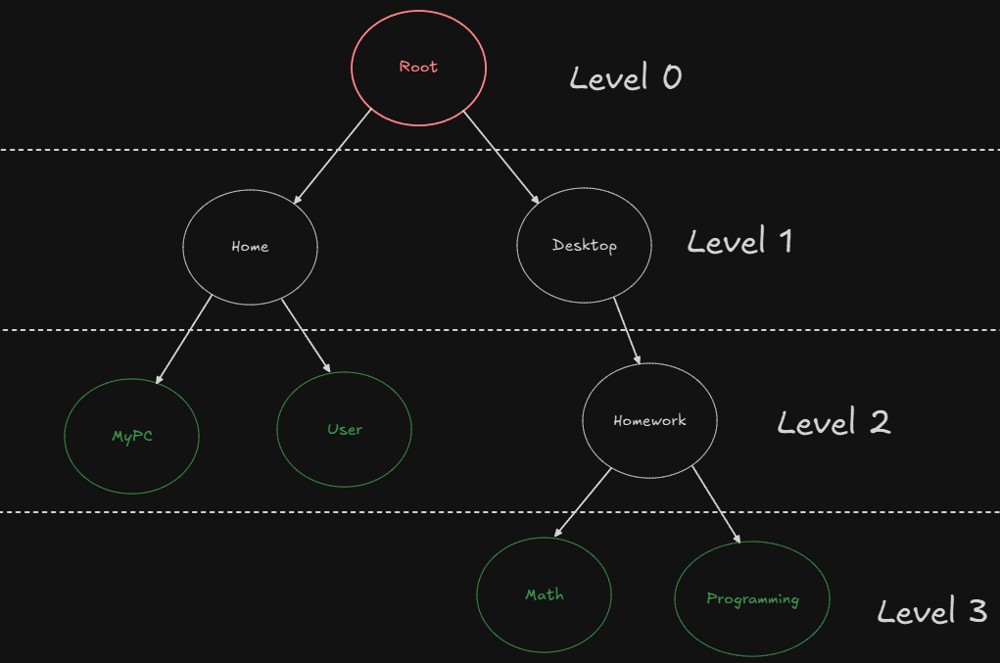
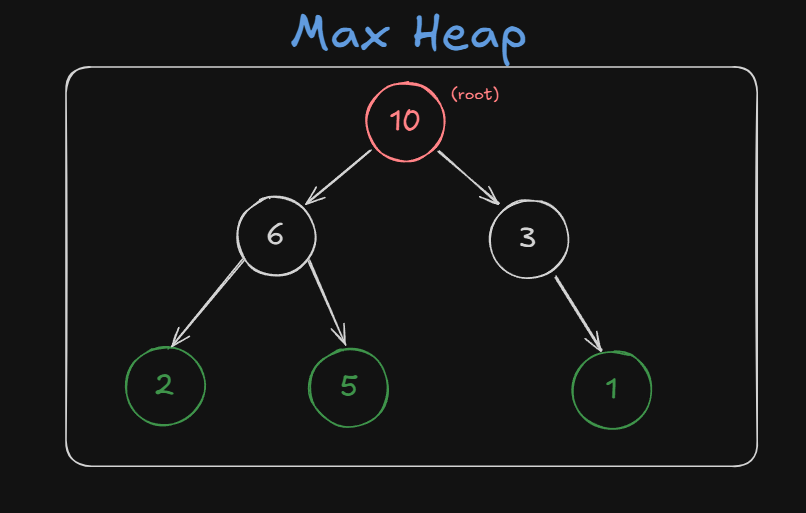

#programacion #cs #algoritmos #DSA

> **Tabla de contenidos:**

- [[#Title 1]]
- [[#Title 2]]
  - [[#Subtitle 1]]
  - [[#Subtitle 2]]
- [[#Title 3]]

# ==🔨ARTICLE IN CONSTRUCTION ==

---

_Cualquier concepto que este erróneo o mal explicado, hágamelo saber con una Issue/Pull Request_

DSA es un acrónimo de **"Data Structures and Algorithms"** (Estructura de datos y algoritmos) e influye un rol importante en la programación debido a que, quieras o no, siempre vas a ser uso de estructuras de datos como **Arrays, Stacks, Queues**, etc. para optimizar la forma en la cual almacenas los datos, y los algoritmos son esenciales para realizar acciones de **búsqueda, agrupación, iterar listas** hasta conceptos mas complejos como buscar el camino mas corto.

**Todos estos conceptos se pueden fortalecer en plataformas como [LeetCode](https://leetcode.com) y las actividades recomendadas estarán en esa plataforma.**

*Empecemos sin dar tanta vueltas.*

## Associative array (Maps/Dictionaries)

El concepto de **Mapa** se utiliza por Java y C++ mientras que **Diccionario** es usado por .Net y Python, así que tratare de englobar esto lo mas que pueda.

Un **Associative Array (Arreglo Asociativo)** almacena los datos en una colección utilizando una _key_ (que será un identificador único al cual, en el código, nos referiremos a ese para obtener el valor almacenado)  y el _value_ el cual será el dato.

Utilizare a JavaScript para realizar este ejemplo.

```javascript
// Associative arrays in JS are Objects
const myAssociativeArray = { day: 'monday', temperature: 23, isRaining: true }

console.log(myAssociativeArray.day) // monday
console.log(myAssociativeArray.isRaining) // true

// Good use for hashTables:
const HTTPHashTable = {
	GET: () => 'SELECT * FROM table',
	POST: () => "INSERT INTO user(name,age) VALUES('Juan',20) ",
	DELETE: () => 'DELETE FROM user WHERE id = 1'
	//... etc
}
const query = HTTPHashTable['GET']() // returns SELECT * FROM table
await sql`${query}`
```

*En algunos lenguajes los array asociativos si se pueden iterar, caso contrario que las HashTables*

## Linked Lists

Una **Linked List (Lista Enlazada)** es una _Linear Data Structure (Estructura de datos lineal)_ de nodos, cada uno referenciando al siguiente y al anterior. Esto tiene variaciones, pero prefiero ir a la base y no indagar en sus diferentes tipos.

La diferencia que tiene de un _Arreglo_ es que cada nodo almacena la referencia de memoria de sus nodos adyacentes. El primer nodo se llama _head_ y el ultimo nodo se llama _tail_ y suele apuntar a un valor _nulo_ para indicar que no hay mas valores a continuación.

Me gusta demasiado asociar esta estructura con POO (aunque no estén relacionados de ninguna manera). Imagínate una instancia con 3 atributos, uno es el _value_ y vamos a suponer que contiene el numero 5 y las otras dos son instancias de la misma clase con el nombre _previousNode_ y _nextNode_.

**Si hacemos un _previousNode.value_ nos daría 4 y _nextNode.value_ nos daría 6.**

Ejemplo en C# de su utilización:

```c#
using System; // this is for the String type & the Console.WriteLine
using System.Collections.Generic; // this is for the LinkedList class

public class Program
{
	public static void Main()
	{
		LinkedList<String> linked = new LinkedList<String>();
		linked.AddLast("head node");
		linked.AddLast("second node");
		linked.AddLast("third node");

		Console.WriteLine(linked.First.Next.Value); //second node
	}
}
```

_Lo ideal seria realizar una función recursiva y detenerse al momento que encuentre un **null**, no conozco demasiado C# para hacer un ejemplo mas pequeño que este pero recomiendo que chequen este [desafío](https://leetcode.com/problems/linked-list-cycle/)._

## Trees

Un **Tree (Árbol)** es una _Non-linear Data Structure (Estructura de datos NO lineal)_, es decir, sus elementos no están alineados secuencialmente por lo tanto no pueden ser todos recorridos en una sola ejecución. Cabe de aclarar que esta estructura siempre suele tener un numero $N$ de nodos y $N-1$ de aristas (debido a que el nodo *Root* no contiene padre).

Esta estructura jerarquiza sus nodos, como si fuese un sistema de carpetas.

```python
Root
├── Home
│	├── MyPC
│	└── User
│
└──	Desktop
	└── Homework
		├── Math
		└── Programming
```

**Binary tree example:**


**Un poco de terminología para estar en la misma pagina:**

- El nodo mas alto se llama _Root_ (pintado de rosa).
- Los nodos sin hijos (nodos descendientes) se llaman _Leaf Node_ (pintados de verde).
- Un _Subtree_ (Subárbol) es un conjunto de nodos (junto a sus descendientes) a destacar dentro del mismo árbol principal. Ejemplo: Un subárbol podría ser Home, MyPC y User.

**Un ejemplo de código sencillo en Python:**

```python
class Tree:
    def __init__(self):
        self.left = None
        self.right = None
        self.name = None

root = Tree()
root.name = "Root"
root.left = Tree()
root.left.name = "Home"
root.right = Tree()
root.right.name = "Desktop"
```

Y así, definiríamos un subárbol de los primeros niveles.

_Al igual que el anterior, esto se podría recorrer con una función recursiva. Recomiendo este [ejercicio sencillo](https://leetcode.com/problems/binary-tree-paths/) para empezar a entender arboles mejor._

#### Tipos de Arboles:

- Un nodo de un _Tree_ puede tener un numero infinito de hijos, mientras que un _Binary Tree (Árbol Binario)_ tiene un máximo de 2 hijos, cuales suelen ser referidos como _Left Node_ y _Right Node_.

- Un _Binary Search Tree (Árbol de búsqueda binaria)_ suele utilizar números como valores, en vez de nombres previamente visto en los ejemplos. Supongamos que el _Root_ empieza con el valor de **10**, el hijo izquierdo de este siempre será menor al nodo padre, es decir, tendrá el valor de **9** o menos mientras que el hijo derecho siempre será mayor al nodo padre, por ejemplo, **11** o mayor. Y así recursivamente con los hijos.

Hay mas tipos de arboles, pero creo que estos tres mencionados dan una base solida para adentrarse a las estructuras de datos. Procura de estudiarlos bien ya que son los mas comunes.


## Stacks & Queues

#### Stacks (Pila)

Una manera sencilla de entender este concepto es imaginarlo como si fuese un _Array/Arreglo_ en el cual al añadir un elemento, este creará un nuevo espacio y se insertara a lo ultimo de este arreglo. Y la forma para remover elementos, es quitando el ultimo elemento. Esto esta basado en el principio **LIFO** (Last In First Out) el cual el primer elemento añadido es procesado a lo **ultimo** y el ultimo elemento es el **primero** a procesar.

**Ejemplo en JS:**
Imagínate que estas lavando los platos y los vas apilando uno arriba del otro, y en el momento que terminas de lavarlos, tienes una pila gigantesca de estos.
Lo mas lógico seria ir quitando desde el mas arriba (El ultimo añadido a la pila) hasta llegar al primer plato que lavaste (El primero añadido a la pila).

```js
const dishStack = [21, 45, 78] //the numbers does not represent anything in particular

// we add more dishes to the stack
dishStack.push(96)
dishStack.push(4)

console.log(dishStack) // [21, 45, 78, 96, 4]

// and then we start to removing the dishes off the stack
dishStack.pop()
console.log(dishStack) // [21, 45, 78, 96]

dishStack.pop()
dishStack.pop()
console.log(dishStack) // [21, 45]
```

#### Queues (Cola/Fila/Hilera)

No es tan distinto a las Stacks a diferencia de que este caso se aplica el principio **FIFO** (First In First Out) que trata que el primer elemento añadido (o el elemento con mas tiempo en la fila) sea el primero a ser procesado.

**Ejemplo en JS:**
Visualiza que estas en un supermercado bastante conocido ubicado en el centro de la ciudad donde te resides. Agarras un carrito y empiezas a colocar los productos que necesitas y una vez que termines de seleccionar lo necesario te diriges a un cajero del mismo establecimiento.
Pero, desafortunadamente, de tanta gente comprando se hizo una **fila**. El que llego mas pronto al cajero va a ser atendido y si alguien llega después de vos, va a ser atendido luego que tu compra termine.

```js
const peopleQueue = ['Alfred', 'Jane', 'Herbert']

//cashier is taking care of the queue
peopleQueue.shift()
peopleQueue.shift()

console.log(peopleQueue) // ["Herbert"]

//more people are joining the queue
peopleQueue.push('Kasey')
peopleQueue.push('Cydney')

console.log(peopleQueue) // ["Herbert", "Kasey", "Cydney"]
```

#### Conceptos Generales sobre Stacks y Queues.

- Ambos son _Linear Data Structure_ y contienen un tamaño dinámico.
- A diferencia de un Array, estos no pueden insertar datos en posiciones aleatorias.
- Todas sus operaciones son de complejidad O(1) ([Articulo sobre el Big O Notation](https://the-amazing-gentleman-programming-book.vercel.app/en/book/Chapter06_Algorithms#big-o-notation)).


## Heaps

Un **Heap (montón)** es una estructura similar a los arboles binarios previamente vistos con una *Priority Queue (Cola de prioridad)*. Lo que lo hace especial a esta estructura de los _Binary Search Tree (Árbol de búsqueda binaria)_ es su facilidad de ordenar Arrays, permite repeticiones, su forma de organizar la información (ver tipos) y la importancia del orden de los nodos.

*Esta estructura tiene 2 tipos predominantes:* 

- **Max Heap:**
El *Root* debe ser el mayor valor de todos los nodos, luego sus hijos deberán siempre ser **menor** o **igual** al nodo padre.
La forma de representación de este Heap en un array seria de:

```python
[10, 6, 3, 2, 5, 1]
```

- **Min Heap:**
El *Root* debe ser el menor valor de todos los nodos, y sus hijos deberán siempre ser **mayor** o **igual** al nodo padre.
La forma de representación de este Heap en un array seria de:
```python
[2, 4, 5, 12, 6, 9, 7]
```


*Para acceder al elemento deseado del Heap, es recomendado utilizar las siguientes operaciones 
( "i" es el índice del elemento del array que se desea saber los siguientes datos):*

-  **Obtener el padre del nodo:**
	- $Array[(i-1)/2]$

- **Obtener el hijo izquierdo del nodo:**
	- $Array[(2*i)+1]$

- **Obtener el hijo derecho del nodo:
	- $Array[(2*i)+2]$

_No voy a brindar un ejemplo de código ya que es demasiado extenso, pero si te voy a dejar una [actividad a resolver](https://leetcode.com/problems/take-gifts-from-the-richest-pile/description/). Aunque la actividad este ligada mas a las priority queues y a la matemática, creo que sigue siendo ideal para resolver._ 


## Graphs

Los **Graphs (Grafos)** son parte de la misma estructura de datos que los *Trees (Arboles)*, una *estructura de datos no lineal*.
La diferencia principal a la de un *Árbol*, es que este **no tiene reglas de como los aristas se deben conectar a los nodos** y su denotación consiste de $G = (V, E)$, siendo *V = vertices* (Nodos) y *E = egdes* (Aristas).

#### Los Aristas pueden ser de dos tipos:

- **Directed (dirigido):** Son aquellos que conectan dos nodos uni-direccionalmente. Es decir, solo van de punto $A → B$ y no viceversa. **Su denotación matemática** es $(A, B)$ siendo $A$ el origen y $B$ el destino.

- **Undirected (no dirigido):** Los no dirigidos, en cambio, conectan dos nodos bi-direccionalmente. Pueden ir de punto $A → B$ y $B → A$. **Su denotación matemática** es { $A,B$ }, sin importar el orden, ya que, no es dirigido.


#### Algoritmos para recorrer grafos.

- **Depth First Search (DFS):**
En *Depth First Search (Búsqueda en Profundidad)* trata de recorrer el grafo lo mas profundo **posible** sin retroceder utilizando nodos adyacentes. Una vez que no haya mas nodos adyacentes para visitar, empieza a retroceder hasta que encuentre mas nodos sin visitar. 

**Extras:**
- Como un árbol, se suele empezar por el subárbol izquierdo, y una vez que lo recorre, va por el derecho.
- Se crea un arreglo donde se almacena (usualmente de manera booleana) si el nodo fue recorrido. 

**Ejemplo (Usa la imagen de abajo como referencia):**

``` bash
- Empieza en 0, Marca como visitado. Output 0
- Recorre 3, Marca como visitado. Output 3
- Recorre 6, Marca como visitado. Output 6
No hay mas nodos adyacentes, se regresa hasta 0.
- Recorre 2, Marca como visitado. Output 2
- Recorre 4, Marca como visitado. Output 4
- Recorre 1, Marca como visitado. Output 1
No hay mas nodos adyacentes, se regresa hasta 4.
- Recorre 5, Marca como visitado. Output 5
Fin.
```


*Usualmente utilizado para PathFinding, resolver laberintos o detección de ciclos en el grafo.*

- **Breadth-First Search (BFS):**
 *Breadth-First Search (Búsqueda en amplitud)*

#### Tipos de representaciones.

#### Mas tipos de grafos

---

# Bibliografía

Me he guiado de los siguientes artículos para desarrollar este tema:
	
- [Google Tech Dev Guide.](https://techdevguide.withgoogle.com/paths/data-structures-and-algorithms)
- [Geeks For Geeks.](https://www.geeksforgeeks.org/data-structures/)
